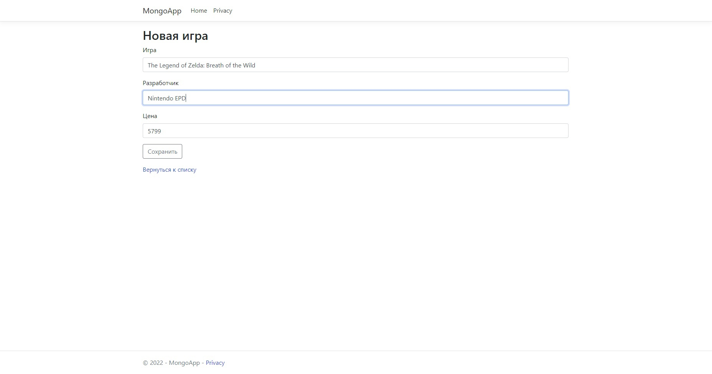
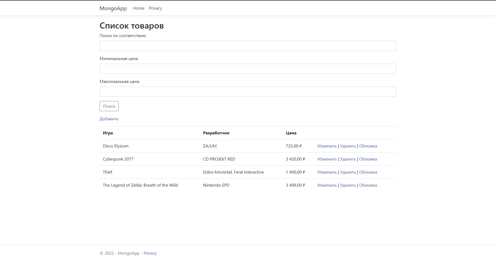

# Тестовое приложение

+ [Общая информация](#общая-информация)
+ [Подключение Mongodb](#подключение-mongodb)
+ [Обзор некоторых функций приложения](#обзор-некоторых-функций-приложения)

  
## Общая информация

Целью данного проекта было разработать приложение с CRUD*-ом для MongoDB на языке программирования C#.

Данное приложение является эмитацией некого игрового магазина, где возможны следующие действия: 

- Добавление товара с тремя характеристиками
- Удаление товара
- Изменение товара
- Добавление обложки товара
- Сортировка товара по определённым критериям

Итоговый результат можно увидеть на изоброжении:

Основной файл с более подробной информацией по данной теме можно посмотреть [**здесь**](https://gitlab.com/interviewnet/Questions/-/blob/main/Database/NoSQL.md).

*CRUD — акроним, обозначающий четыре базовые функции, используемые при работе с базами данных:
- создание (create)
- чтение (read)
- модификация (update)
- удаление (delete)

[к оглавлению](#текстовое-приложение)

## Подключение Mongodb

MongoDB — это документо-ориентированная система управления базами данных, которая не требует описания схемы таблиц.
Считается одним из классических примеров NoSQL-систем, использует JSON (JavaScript Object Notation) -подобные документы и схему базы данных.
Написана на языке C++.

Подлючение mongodb к проекту осуществлялось следующим образом:

- Уставка самой БД и вспомогательного приложения MongoDB Compass. В этом приложение шло подключение к локальной базе данных:

- Далее требовалось загрузить несколько необходимых компонентов в сам проект для последущей работы с СУБД (**MongoDB.Driver** и **MongoDB.Driver.GridFS**).

[к оглавлению](#текстовое-приложение)

## Обзор некоторых функций приложения

Продемонстрируем некоторые функции получавшегося приложения:

- Добавление

- Редактирование

- Посмотреть итог предыдущих действий можно на главной странице

- Сортировка по определённым пунктам

[к оглавлению](#текстовое-приложение)
