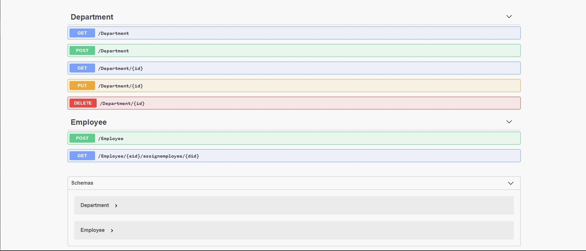
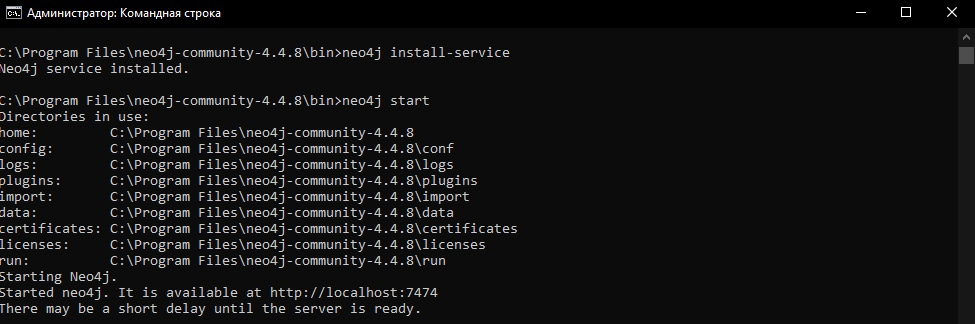
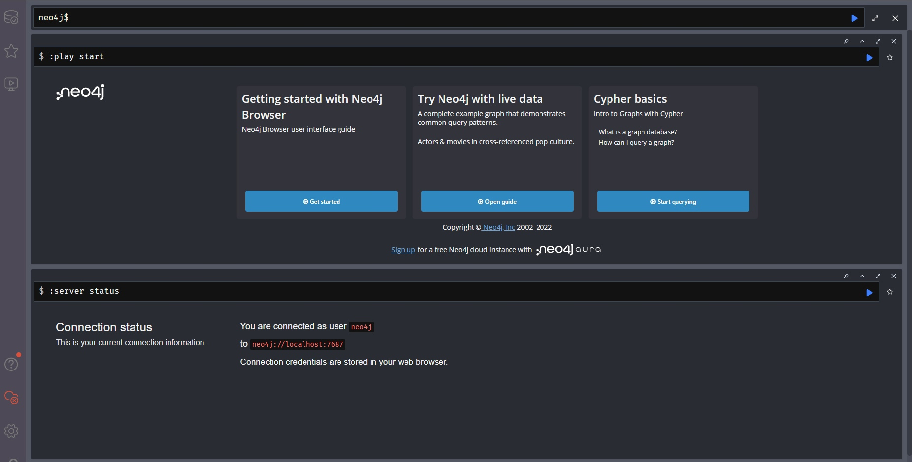
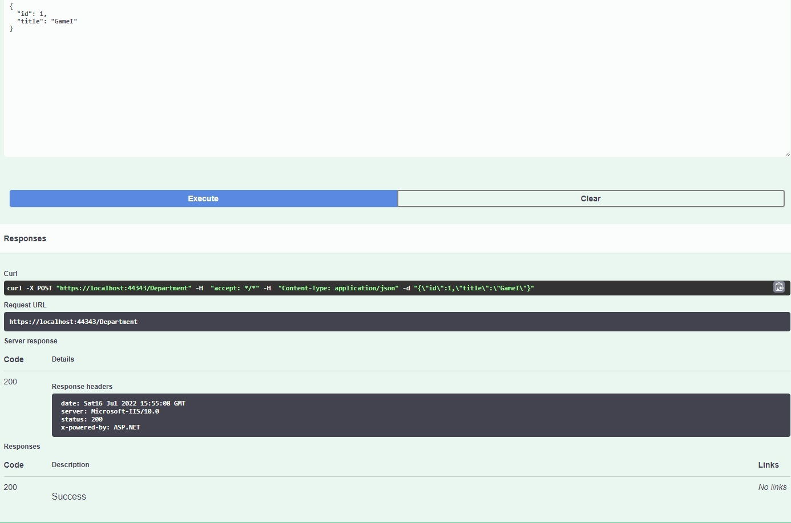
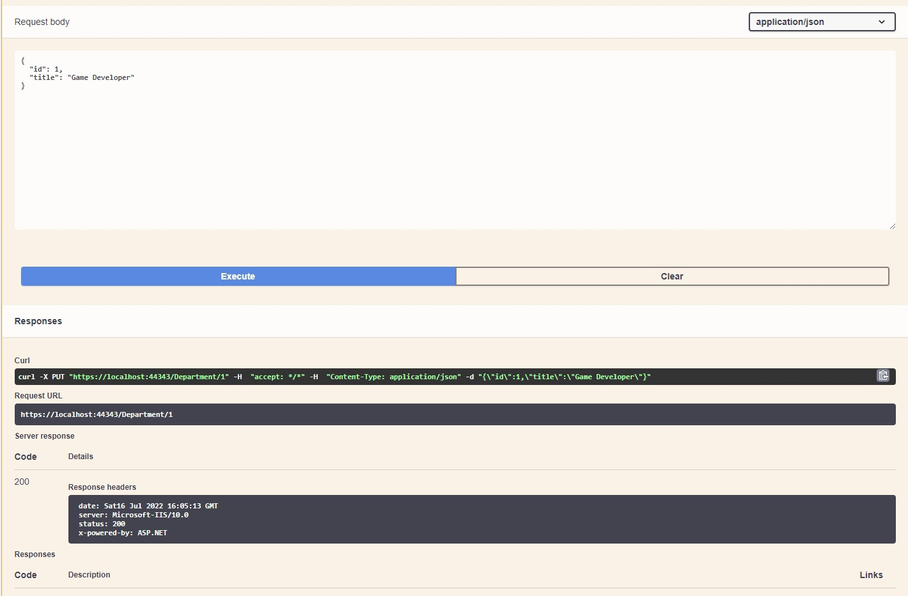
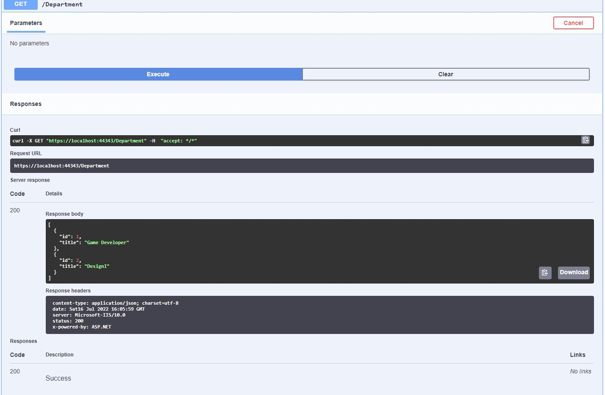
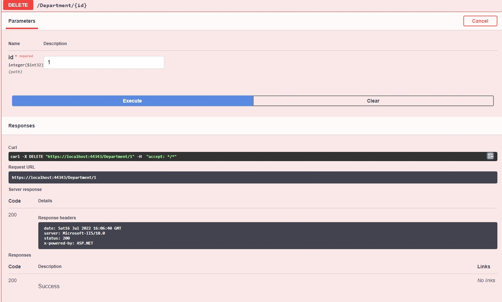

# Приложение

+ [Общая информация](#общая-информация)
+ [Подключение к Neo4j](#подключение-к-neo4j)
+ [Обзор некоторый функций приложения](#обзор-некоторых-функций-приложения)

  
## Общая информация

Целью данного проекта было разработать приложение с CRUD*-ом для Neo4j на языке программирования C# (и Cypher).

Данное приложение является эмитацией некого рабочего приложения, где можно хранить инфомацию о отделах и сотрудниках.  

Получившийся результат можно увидеть на изоброжении:

Основной файл с более подробной информацией по данной теме можно посмотреть [**здесь**](https://gitlab.com/interviewnet/Questions/-/blob/main/Database/NoSQL.md).

*CRUD — акроним, обозначающий четыре базовые функции, используемые при работе с базами данных:
- создание (create)
- чтение (read)
- модификация (update)
- удаление (delete)

[к оглавлению](#текстовое-приложение)

## Подключение к Neo4j

Neo4j - это высокопроизводительная база данных NOSQL Graph Database, которая хранит структурированные данные в сети, а не в таблицах.
База данных графов также называется системой управления базами данных графов или GDBMS.
Это встроенный механизм сохраняемости Java на основе диска с полными характеристиками транзакций, но он хранит структурированные данные в сети (называемые графом с математической точки зрения) и Не в таблице.

Подлючение Neo4j к проекту осуществлялось следующим образом:

- Распаковка самой БД и запуск её с консоли:

- После консоли появится ссылка, открыв её через браузер мы сможем пользоваться БД Neo4j:

[к оглавлению](#текстовое-приложение)

## Обзор некоторый функций приложения

Продемонстрируем некоторые функции получавшегося приложения:

- Добавление

- Редактирование

- Посмотреть 

- Удаление

Также все эти изменение в виде графов можно наблюдать в самой базе Neo4j, в которую мы вошли по сылке.

[к оглавлению](#текстовое-приложение)
