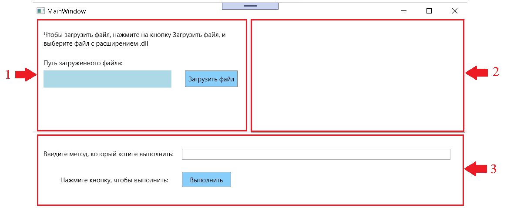
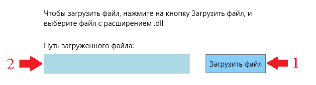
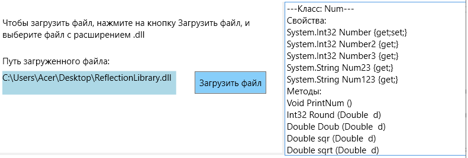

# Рефлексия

+ [Общая информация](#общая-информация)
+ [Интерфейс приложения](#интерфейс-приложения)
+ [Как в приложении загрузить файл?](#как-в-приложении-загрузить-файл)

## Общая информация:

В данном решении содержится приложение, которое позволяет:
 -  Динамически загрузить сборку
 -  Вывести информацию о типах сборки (методах и свойствах)
 -  Ввести команду в формате: *Имя_Типа.Имя_Метода(Знач_арг1, Знач_арг2, ..., Знач_аргZ)*

Основной **файл** с подробной информацией по данной теме можно посмотреть
[**здесь**](https://gitlab.com/interviewnet/Questions/-/blob/main/General/Reflections.md).

[к оглавлению](#рефлексия)

## Интерфейс приложения

Окно приложения разделено на три блока:
 - Загрузка сборки
 - Информация о типах сборки
 - Вызов метода

[к оглавлению](#рефлексия)

## Как в приложении загрузить файл?

Чтобы загрузить файл, необходимо нажать на кнопку **Загрузить файл**, и выбрать файл с 
расширением **"*.dll"** (на рисунке 2 пункт 1). Путь к выбранному файлу отобразится в TextBox (на рисунке 2 пункт 2).

После загрузки файла внешний вид приложения будет выглядеть следующим образом:

[к оглавлению](#рефлексия)
